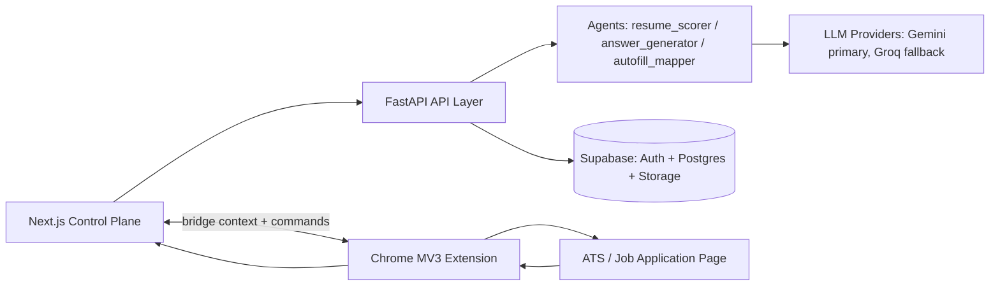

# AI Job Application Assistant

AI-powered job application workflow that turns repetitive application work into a structured system: profile management, resume-to-JD scoring, tailored answer generation, and extension-based in-tab autofill execution.

This is a full-stack portfolio project designed to show production-style engineering decisions under real constraints: LLM variability, ATS variability, auth/session boundaries, and browser execution context.


**Built by Abhinav Dave** - portfolio project focused on end-to-end delivery and engineering rigor.

---

## Why This Exists

Job applications are repetitive and time-consuming: candidates rewrite similar responses, manually map the same profile data across inconsistent ATS forms, and lose visibility into what was submitted and why.

This project solves that with:
- a **control plane** for profile + application workflow,
- a **decision engine** for scoring, answer generation, and mapping,
- an **action plane** (browser extension) for reliable in-tab execution.

**Why this matters:** backend-only automation breaks on many ATS flows because authenticated state and dynamic DOM behavior live in the user tab, not on the server.

**User outcome:** faster applications, more consistent quality, and a trackable pipeline with reusable score/answer artifacts.

---

## Demo / Proof

### Local demo in <10 minutes

No hosted deployment is required to evaluate this project. The full workflow is runnable locally.

### What to click first
1. Open `http://localhost:3000`, register/login.
2. Go to **Profile**, add resume and background data.
3. Go to **Jobs**, create/select an application with JD URL or pasted JD text.
4. Run **Resume Score**.
5. Go to **Autofill**, run **Mapping Preview** for a target page URL.
6. Use extension popup: **Execute fill in browser tab**.

### Expected outputs (success criteria)
- **Resume scoring:** match score, grade, gap suggestions, ATS risk signal.
- **Answer generation:** first-person, bounded-length tailored response.
- **Autofill preview:** mapped fields, confidence levels, diagnostics, unfilled list.
- **Execution telemetry:** fill summary returned from extension and reflected in application notes.

---

## Key Features (Outcome-First)

### Tailored response generation
- **User value:** Produces JD-aware draft answers quickly.
- **Implementation note:** FastAPI answer agent with provider fallback path (Gemini primary, Groq fallback, deterministic cleanup + quality checks).

### Resume-to-JD scoring
- **User value:** Quantifies fit before spending time on an application.
- **Implementation note:** Resume source normalization + JD acquisition + validated typed `ResumeScoreResult`.

### Autofill mapping preview + in-tab execution
- **User value:** Lets users review confidence before writing into live ATS forms.
- **Implementation note:** Rule-first mapping with LLM fallback for unmapped fields; actual form interaction executed in Chrome MV3 content-script context.

### Application pipeline tracking
- **User value:** Keeps application status and notes in one place.
- **Implementation note:** Typed CRUD endpoints over Supabase `applications` table with status filtering.

### Score report persistence
- **User value:** Preserves scoring rationale for each application.
- **Implementation note:** Dedicated `application_score_reports` table with per-application upsert/read endpoints.

---

## Architecture (Recruiter + Engineer Friendly)



### Data flow
1. Frontend authenticates with Supabase, then calls `/api/...` with bearer token.
2. Backend validates auth and executes agent workflows.
3. Agents call LLM providers with retry/fallback and JSON parse hardening.
4. Backend persists profile/application/score data to Supabase.
5. Frontend syncs extension bridge context; extension executes fill in the user tab and posts telemetry back.

### Separation of concerns
- **Control plane (web app):** orchestration, review UX, state management.
- **Decision engine (backend):** scoring/mapping/answer logic plus provider resilience.
- **Action plane (extension):** in-tab DOM interactions where session and page state exist.

---

## Tech Stack

| Layer | Technology | Why chosen |
|---|---|---|
| Frontend | Next.js 14 (App Router), React, TypeScript | Fast UI iteration with typed state and route-level structure |
| Backend | FastAPI, Pydantic | Typed API contracts and explicit error semantics |
| Auth + DB | Supabase Auth + Postgres + Storage | Rapid MVP backend with SQL migration history and JWT auth |
| LLM integration | Gemini + Groq fallback | Better availability under transient provider/model failures |
| Browser automation | Chrome Extension MV3 | Reliable in-tab execution for authenticated/dynamic ATS pages |
| Parsing/scraping | PyMuPDF, httpx, BeautifulSoup | Resume text extraction and practical JD ingestion |
| Quality gates | Pytest, Next lint/build | Regression discipline across backend and frontend |

---

## Engineering Challenges & Solutions

### 1) LLM reliability under provider/model failures
- **Challenge:** 429/503/unavailable/deprecated model failures can break user flows.
- **Why hard:** Failures are intermittent and provider-specific.
- **Final solution:** Model-chain retries in `backend/services/llm.py`, retryability checks, Gemini-to-Groq fallback in agents.
- **Tradeoff:** More orchestration complexity and logging paths.

### 2) JSON output mismatch from LLMs
- **Challenge:** Responses can include fenced JSON, preambles, or malformed payloads.
- **Why hard:** Downstream code requires strict typed objects.
- **Final solution:** `parse_json_from_response()` supports direct/fenced/embedded parsing plus schema validation/correction retries.
- **Tradeoff:** Additional parsing logic and retry cost.

### 3) ATS variability for autofill mapping
- **Challenge:** Field naming/type/visibility differs widely across ATS implementations.
- **Why hard:** Pure deterministic rules miss long-tail custom fields.
- **Final solution:** Rule-first mapping + LLM fallback only for unmapped fields, confidence thresholds, diagnostics.
- **Tradeoff:** Low-confidence fields are intentionally left as suggestions.

### 4) Auth/session mismatch in automation
- **Challenge:** Backend automation cannot reliably reproduce user-tab authenticated state.
- **Why hard:** Cookies/session DOM state are browser-local and often anti-bot-protected.
- **Final solution:** Bridge architecture where extension executes in active tab and returns telemetry to app.
- **Tradeoff:** Requires extension install and context synchronization.

### 5) Error taxonomy for recovery UX
- **Challenge:** Generic failures are hard for users to recover from.
- **Why hard:** Multiple agent and provider failure modes must stay consistent.
- **Final solution:** Structured flat error payloads; `422` for user-fixable input/content issues, `503` for provider availability.
- **Tradeoff:** More explicit exception mapping code in routers.

### 6) Serialization/date edge cases
- **Challenge:** Mixed typed payloads (dates/datetimes) can fail during persistence.
- **Why hard:** Patch/update requests pass through multiple model layers.
- **Final solution:** Explicit JSON-mode dumps (for example, application patch updates).
- **Tradeoff:** Requires strict conversion boundaries.

### 7) Profile bootstrap + stale auth edge cases
- **Challenge:** Token/profile inconsistencies can break profile initialization.
- **Why hard:** Auth and profile tables can drift in local/dev states.
- **Final solution:** Defensive profile bootstrap and missing-column tolerant update strategy in users router.
- **Tradeoff:** Added compatibility complexity for older local schemas.

---

## Product Decisions & Tradeoffs

### Why not backend-only autofill execution?
Because reliable ATS interaction requires the user’s active authenticated tab context and live DOM behavior.

### Why extension bridge?
It keeps execution in the only context that can reliably interact with ATS forms while preserving web-app orchestration and review UX.

### Why Supabase for MVP?
To ship auth + relational data quickly with migration history and minimal infrastructure overhead.

### Why fallback LLM strategy?
To degrade gracefully under provider/model failures instead of hard-failing key user workflows.

### What was intentionally deferred?
- Multi-browser extension support
- Full ATS vendor-specific adapters
- Hosted production deployment profile
- Advanced telemetry analytics dashboard

---

## Security & Privacy Notes

- **Stored:** profile data, work/education records, applications, score reports, fill telemetry notes.
- **Not stored by default:** ATS credentials.
- **Auth model:** Supabase JWT bearer validation on protected backend routes.
- **Sensitive handling:** backend prompt loading is path-constrained; local mock profile overrides are optional/dev-only.
- **Disclaimer:** portfolio MVP; perform production hardening (secrets management, monitoring, deployment controls) before real-world use.

---

## Project Structure

```text
frontend/                 # Next.js control plane (dashboard, profile, jobs, resume, answers, autofill)
backend/                  # FastAPI app, routers, services, agents, tests
backend/agents/           # Core decision logic: scoring, mapping, answer generation
backend/services/         # LLM provider handling + Supabase integration
backend/tools/            # Resume parsing and JD scraping utilities
extension/                # Chrome MV3 bridge (background/content/popup/options)
supabase/migrations/      # SQL schema history (users, applications, score reports, triggers)
docs/                     # Architecture/API documentation
```

---

## API Surface (High-Value Endpoints)

- `GET /api/health` - health + DB/LLM reachability snapshot.
- `POST /api/auth/verify` - validates bearer token, returns authenticated `user_id`.
- `POST /api/users` - create/update initial profile row.
- `GET /api/users/me` - fetch authenticated profile.
- `PATCH /api/users/me` - update profile/work history/education.
- `POST /api/resume/analyze` - resume + JD scoring pipeline.
- `POST /api/generate/answer` - tailored answer generation pipeline.
- `POST /api/autofill` - mapping preview with confidence diagnostics.
- `GET/POST/PATCH/DELETE /api/applications` - application pipeline CRUD.
- `GET /api/applications/{id}/score-report` - fetch score report.
- `PUT /api/applications/{id}/score-report` - upsert score report.
- `POST /api/feedback` - log agent feedback payload.

---

## Local Setup (Zero-Friction)

### Prerequisites
- Node.js LTS
- Python 3.11+
- Supabase project with Auth + Postgres configured

### 1) Clone
```bash
git clone <repo-url>
cd Job-Assistant-Agent
```

### 2) Configure env files

Backend (`.env` in repo root or `backend/.env`):
- `SUPABASE_URL`
- `SUPABASE_ANON_KEY`
- `SUPABASE_SERVICE_ROLE_KEY`
- `SUPABASE_JWT_SECRET`
- `GOOGLE_GEMINI_API_KEY`

Optional backend:
- `GROQ_API_KEY`
- `GEMINI_MODEL`
- `GEMINI_MODEL_FALLBACK`
- `LLM_TIMEOUT_SECONDS`
- `ANSWER_MAX_WORDS`

Frontend (`frontend/.env.local`):
- `NEXT_PUBLIC_SUPABASE_URL`
- `NEXT_PUBLIC_SUPABASE_ANON_KEY`
- `NEXT_PUBLIC_API_URL` (usually `http://127.0.0.1:8000`)

### 3) Install dependencies
```bash
cd frontend && npm install
cd ../backend && pip install -r requirements.txt
cd ..
```

### 4) Apply Supabase migrations
Run SQL files in `supabase/migrations/` in order (`001` through `008`).

### 5) Start backend
```bash
cd backend
python -m uvicorn main:app --reload --host 0.0.0.0 --port 8000
```

### 6) Start frontend
```bash
cd frontend
npm run dev
```

### 7) Load extension unpacked
1. Open `chrome://extensions`
2. Enable Developer mode
3. Load unpacked `extension/`
4. Keep dashboard tab open and logged in during extension actions

### 8) Smoke-test flow
1. Login and save profile.
2. Create/select a job and run resume scoring.
3. Run autofill mapping preview.
4. Execute fill from extension popup.
5. Confirm telemetry appears in app workflow.

### Common setup mistakes
- **Frontend cannot reach backend:** verify `NEXT_PUBLIC_API_URL`.
- **401 responses on protected routes:** refresh auth session (sign out/sign in).
- **`jd_scrape_failed`:** paste JD text directly for ATS pages that block scraping.
- **Extension bridge context missing:** refresh dashboard tab and retry popup action.

---

## Verification / Quality Gates

```bash
# backend
cd backend
python -m pytest

# frontend
cd ../frontend
npm run lint
npm run build
```

Passing state should show:
- Backend test suite green (current baseline: `59 passed`)
- Frontend lint clean
- Frontend production build successful

---

## Impact Summary (Portfolio Framing)

This project demonstrates:
- Full-stack architecture ownership (web app + API + database + extension)
- AI integration under real failure modes (retry/fallback/parse hardening)
- Product-oriented iteration through multi-phase hardening
- Reliability discipline via typed contracts and verification gates
- End-to-end shipping across UX, backend logic, and operational concerns

---

## Roadmap

- Broaden ATS coverage with provider-specific form adapters
- Add stronger extension telemetry and replayable debug traces
- Add job discovery ingestion and structured posting normalization
- Improve score explainability (requirement-to-evidence mapping)
- Optional auth abstraction/migration path (for example, Clerk)
- Production deployment hardening (containers, CI/CD, environment promotion)
- Add analytics surface for application outcomes
- Improve low-confidence mapping resolution UX in extension/app

---

## Recruiter Quick Scan

- **Project type:** AI-enabled full-stack productivity product
- **Role performed:** Solo builder (product, architecture, implementation, testing)
- **Timeframe:** Iterative delivery through Phase 12 hardening
- **Core competencies:** Next.js, FastAPI, Supabase, LLM reliability engineering, Chrome extension integration, API design
- **Best files to review first:**
  - `backend/services/llm.py`
  - `backend/agents/autofill_mapper.py`
  - `backend/agents/resume_scorer.py`
  - `frontend/context/phase10-app-context.tsx`
  - `backend/routers/applications.py`

---

## License / Credits

- **License:** TODO - add a `LICENSE` file and update this section.
- **Credits:** Built and maintained by Abhinav Dave.
